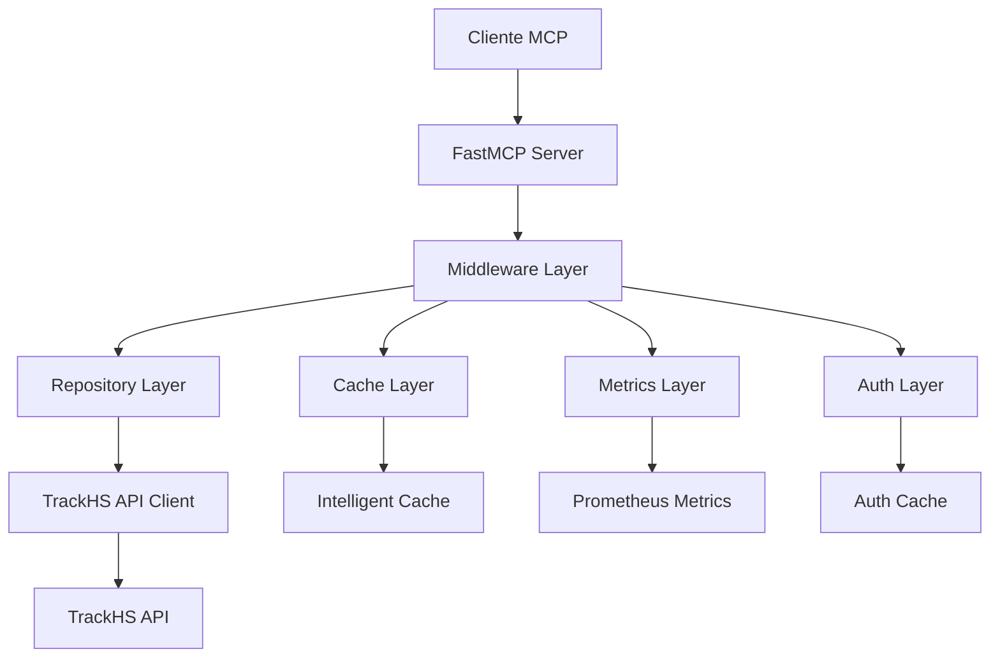

# 📚 Referencia de API - TrackHS MCP Server

## 🎯 Descripción General

El **TrackHS MCP Server** es un servidor Micro-Capability Platform (MCP) que proporciona acceso completo a la API de TrackHS para gestión de propiedades de alquiler vacacional. Implementa arquitectura de microservicios con patrones Repository, cache inteligente, métricas Prometheus y middleware nativo FastMCP.

## 🏗️ Arquitectura

### Componentes Principales



### Patrones Implementados

- **Repository Pattern**: Separación de lógica de acceso a datos
- **Middleware Pattern**: Procesamiento de requests en cadena
- **Cache-Aside Pattern**: Cache inteligente con estrategias adaptativas
- **Circuit Breaker**: Resilencia contra fallos de API externa
- **Observer Pattern**: Métricas y logging distribuido

## 🛠️ Herramientas MCP Disponibles

### 1. Búsqueda de Reservas

**Función**: `search_reservations`

**Descripción**: Busca reservas con filtros avanzados y paginación.

**Parámetros**:
- `page` (int, opcional): Número de página (0-10000)
- `size` (int, opcional): Tamaño de página (1-100)
- `search` (str, opcional): Búsqueda de texto completo
- `arrival_start` (str, opcional): Fecha de llegada inicio (YYYY-MM-DD)
- `arrival_end` (str, opcional): Fecha de llegada fin (YYYY-MM-DD)
- `status` (str, opcional): Estado de reserva

**Ejemplo de uso**:
```python
# Buscar reservas confirmadas del 15 de enero
result = await search_reservations(
    arrival_start="2024-01-15",
    arrival_end="2024-01-15",
    status="confirmed",
    size=50
)
```

**Respuesta**:
```json
{
  "page": 1,
  "page_count": 1,
  "page_size": 50,
  "total_items": 25,
  "_embedded": {
    "reservations": [
      {
        "id": 12345,
        "confirmation_number": "CONF123",
        "guest": {
          "name": "John Doe",
          "email": "john@example.com"
        },
        "arrival_date": "2024-01-15",
        "departure_date": "2024-01-20",
        "status": "confirmed"
      }
    ]
  }
}
```

### 2. Obtener Detalles de Reserva

**Función**: `get_reservation`

**Descripción**: Obtiene información completa de una reserva específica.

**Parámetros**:
- `reservation_id` (int, requerido): ID único de la reserva

**Ejemplo de uso**:
```python
# Obtener detalles de reserva
reservation = await get_reservation(reservation_id=12345)
```

**Respuesta**:
```json
{
  "id": 12345,
  "confirmation_number": "CONF123",
  "guest": {
    "name": "John Doe",
    "email": "john@example.com",
    "phone": "+1234567890",
    "address": "123 Main St, City, State"
  },
  "arrival_date": "2024-01-15",
  "departure_date": "2024-01-20",
  "status": "confirmed",
  "unit": {
    "id": 100,
    "name": "Casa de Playa",
    "code": "CP001"
  },
  "balance": 500.0,
  "policies": {
    "cancellation": "Flexible",
    "deposit_required": true
  }
}
```

### 3. Búsqueda de Unidades

**Función**: `search_units`

**Descripción**: Busca unidades de alojamiento con filtros específicos.

**Parámetros**:
- `page` (int, opcional): Número de página (1-400)
- `size` (int, opcional): Tamaño de página (1-25)
- `search` (str, opcional): Búsqueda de texto
- `bedrooms` (int, opcional): Número exacto de dormitorios
- `bathrooms` (int, opcional): Número exacto de baños
- `is_active` (int, opcional): Filtrar por unidades activas (1/0)
- `is_bookable` (int, opcional): Filtrar por unidades disponibles (1/0)

**Ejemplo de uso**:
```python
# Buscar unidades de 2 dormitorios, 1 baño
units = await search_units(
    bedrooms=2,
    bathrooms=1,
    is_active=1,
    is_bookable=1
)
```

### 4. Búsqueda de Amenidades

**Función**: `search_amenities`

**Descripción**: Busca amenidades disponibles en el sistema.

**Parámetros**:
- `page` (int, opcional): Número de página (1-1000)
- `size` (int, opcional): Tamaño de página (1-100)
- `search` (str, opcional): Búsqueda en nombre de amenidad

**Ejemplo de uso**:
```python
# Buscar amenidades relacionadas con WiFi
amenities = await search_amenities(search="wifi")
```

### 5. Obtener Folio Financiero

**Función**: `get_folio`

**Descripción**: Obtiene el folio financiero completo de una reserva.

**Parámetros**:
- `reservation_id` (int, requerido): ID de la reserva

**Ejemplo de uso**:
```python
# Obtener folio financiero
folio = await get_folio(reservation_id=12345)
```

**Respuesta**:
```json
{
  "reservation_id": 12345,
  "balance": 500.0,
  "charges": [
    {
      "type": "accommodation",
      "description": "Noches de alojamiento",
      "amount": 400.0,
      "date": "2024-01-15"
    }
  ],
  "payments": [
    {
      "type": "deposit",
      "amount": 100.0,
      "date": "2024-01-10",
      "status": "completed"
    }
  ],
  "taxes": [
    {
      "type": "city_tax",
      "amount": 25.0,
      "rate": 0.05
    }
  ]
}
```

### 6. Crear Orden de Mantenimiento

**Función**: `create_maintenance_work_order`

**Descripción**: Crea una orden de trabajo de mantenimiento.

**Parámetros**:
- `unit_id` (int, requerido): ID de la unidad
- `summary` (str, requerido): Resumen del problema
- `description` (str, requerido): Descripción detallada
- `priority` (int, opcional): Prioridad (1=Baja, 3=Media, 5=Alta)
- `estimated_cost` (float, opcional): Costo estimado
- `estimated_time` (int, opcional): Tiempo estimado en minutos
- `date_received` (str, opcional): Fecha de recepción (YYYY-MM-DD)

**Ejemplo de uso**:
```python
# Crear orden de mantenimiento urgente
work_order = await create_maintenance_work_order(
    unit_id=123,
    summary="Fuga en grifo",
    description="Grifo del baño principal gotea constantemente",
    priority=5,
    estimated_cost=150.0
)
```

### 7. Crear Orden de Housekeeping

**Función**: `create_housekeeping_work_order`

**Descripción**: Crea una orden de trabajo de limpieza.

**Parámetros**:
- `unit_id` (int, requerido): ID de la unidad
- `scheduled_at` (str, requerido): Fecha programada (YYYY-MM-DD)
- `is_inspection` (bool, opcional): Si es inspección (default: False)
- `clean_type_id` (int, opcional): ID del tipo de limpieza
- `comments` (str, opcional): Comentarios especiales
- `cost` (float, opcional): Costo del servicio

**Ejemplo de uso**:
```python
# Crear orden de limpieza
work_order = await create_housekeeping_work_order(
    unit_id=123,
    scheduled_at="2024-01-15",
    is_inspection=False,
    clean_type_id=1,
    comments="Limpieza post-evento"
)
```

## 🔧 Configuración

### Variables de Entorno

**Requeridas**:
- `TRACKHS_USERNAME`: Usuario de TrackHS API
- `TRACKHS_PASSWORD`: Contraseña de TrackHS API

**Opcionales**:
- `TRACKHS_API_URL`: URL base de la API (default: https://api.trackhs.com)
- `CACHE_TTL`: TTL del cache en segundos (default: 300)
- `RATE_LIMIT_RPM`: Requests por minuto (default: 60)
- `METRICS_ENABLED`: Habilitar métricas (default: true)

### Configuración FastMCP

```json
{
  "source": {
    "path": "src/trackhs_mcp/__main__.py:mcp"
  },
  "environment": {
    "type": "uv",
    "python": ">=3.11",
    "requirements": "requirements.txt",
    "fastmcp_version": "2.13.0"
  },
  "server": {
    "name": "TrackHS API",
    "description": "Servidor MCP para TrackHS API",
    "version": "2.0.0"
  },
  "logging": {
    "level": "INFO",
    "format": "json"
  },
  "cors": {
    "origins": ["https://claude.ai", "https://app.claude.ai"],
    "credentials": true
  },
  "health_check": {
    "enabled": true,
    "endpoint": "/health",
    "timeout": 30
  }
}
```

## 📊 Monitoreo y Métricas

### Health Check

**Endpoint**: `/health`

**Respuesta**:
```json
{
  "status": "healthy",
  "timestamp": "2024-01-15T10:30:00Z",
  "uptime_seconds": 3600,
  "dependencies": {
    "trackhs_api": "healthy",
    "cache": "healthy"
  },
  "metrics": {
    "total_requests": 1500,
    "successful_requests": 1485,
    "failed_requests": 15,
    "average_response_time_seconds": 0.8,
    "cache_hit_rate_percentage": 85.2
  }
}
```

### Métricas Prometheus

**Endpoint**: `/metrics`

**Métricas disponibles**:
- `trackhs_mcp_requests_total`: Total de requests
- `trackhs_mcp_errors_total`: Total de errores
- `trackhs_mcp_request_duration_seconds`: Duración de requests
- `trackhs_mcp_cache_hits_total`: Hits de cache
- `trackhs_mcp_cache_misses_total`: Misses de cache
- `trackhs_mcp_trackhs_api_requests_total`: Requests a TrackHS API
- `trackhs_mcp_trackhs_api_duration_seconds`: Duración de requests a TrackHS API

## 🚨 Manejo de Errores

### Códigos de Error

- `400`: Bad Request - Parámetros inválidos
- `401`: Unauthorized - Error de autenticación
- `403`: Forbidden - Sin permisos
- `404`: Not Found - Recurso no encontrado
- `429`: Too Many Requests - Rate limit excedido
- `500`: Internal Server Error - Error interno
- `502`: Bad Gateway - Error de TrackHS API
- `503`: Service Unavailable - Servicio no disponible

### Tipos de Excepción

```python
# Errores de autenticación
AuthenticationError("Credenciales inválidas")

# Errores de API
APIError("Error en TrackHS API: 500 Internal Server Error")

# Errores de validación
ValidationError("ID de reserva debe ser un entero positivo")

# Errores de conexión
ConnectionError("No se pudo conectar con TrackHS API")

# Errores de rate limit
RateLimitError("Límite de requests excedido")

# Errores de recurso no encontrado
NotFoundError("Reserva no encontrada")
```

## 🔄 Cache y Rendimiento

### Estrategias de Cache

1. **Cache-Aside**: Cache manual con invalidación explícita
2. **Write-Through**: Escritura simultánea a cache y API
3. **Write-Behind**: Escritura diferida a API
4. **TTL Adaptativo**: TTL basado en frecuencia de acceso

### Configuración de Cache

```python
# Cache por defecto
cache = IntelligentCache(
    max_size=1000,
    default_ttl=300,  # 5 minutos
    strategy=CacheStrategy.ADAPTIVE
)

# Cache específico por tipo de dato
reservation_cache = IntelligentCache(
    max_size=500,
    default_ttl=600,  # 10 minutos
    strategy=CacheStrategy.CACHE_ASIDE
)
```

## 🧪 Testing

### Ejecutar Tests

```bash
# Tests unitarios
python -m pytest tests/test_business_validators.py -v

# Tests de integración
python -m pytest tests/test_repositories_integration.py -v

# Tests con cobertura
python -m pytest --cov=src/trackhs_mcp --cov-report=html tests/

# Testing comprehensivo
python scripts/run_comprehensive_tests.py
```

### Tipos de Tests

1. **Unitarios**: Validadores, sanitización, retries
2. **Integración**: Repositories, cache, middleware
3. **MCP**: Protocolo, servidor, health check
4. **Herramientas**: Cada herramienta MCP individualmente
5. **Rendimiento**: Carga, latencia, concurrencia

## 📈 Mejores Prácticas

### Uso de Herramientas

1. **Siempre validar parámetros** antes de llamar herramientas
2. **Usar paginación** para listas grandes
3. **Implementar retry logic** para requests fallidos
4. **Cachear respuestas** cuando sea apropiado
5. **Manejar errores** de forma consistente

### Configuración

1. **Configurar rate limiting** apropiado
2. **Monitorear métricas** regularmente
3. **Ajustar TTL de cache** según patrones de uso
4. **Implementar circuit breaker** para resilencia
5. **Usar logging estructurado** para debugging

### Seguridad

1. **Nunca loggear credenciales** sensibles
2. **Validar inputs** estrictamente
3. **Implementar rate limiting** para prevenir abuso
4. **Usar HTTPS** para todas las comunicaciones
5. **Rotar credenciales** regularmente

## 🔗 Enlaces Útiles

- [Documentación FastMCP](https://gofastmcp.com/)
- [Documentación TrackHS API](https://docs.trackhs.com/)
- [Protocolo MCP](https://modelcontextprotocol.io/)
- [Prometheus Metrics](https://prometheus.io/docs/)
- [Pydantic Validation](https://docs.pydantic.dev/)

## 📞 Soporte

Para soporte técnico o reportar bugs:

- **Email**: ihsolutionsco@gmail.com
- **GitHub**: [mcpTrackhsConnector](https://github.com/ihsolutionsco-hue/mcpTrackhsConnector)
- **Documentación**: [docs/](docs/)

---

*Última actualización: 2024-01-15*
