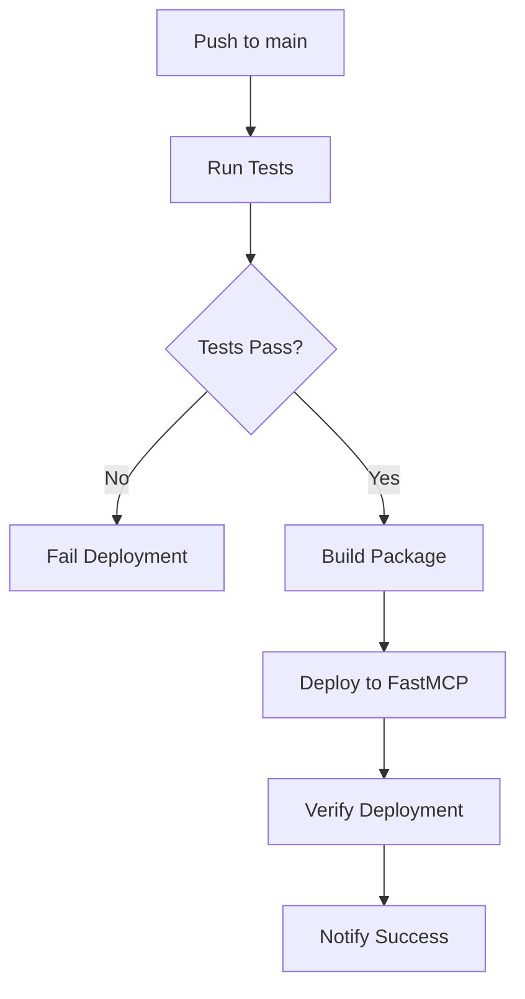

# Deployment Guide - TrackHS MCP Connector

Esta guía explica cómo desplegar el TrackHS MCP Connector en diferentes entornos.

## 📋 Índice

- [Deployment Automático](#deployment-automático)
- [Configuración de Secrets](#configuración-de-secrets)
- [Deployment Manual](#deployment-manual)
- [Verificación de Deployment](#verificación-de-deployment)
- [Monitoreo](#monitoreo)
- [Troubleshooting](#troubleshooting)

## 🚀 Deployment Automático

### GitHub Actions

El deployment automático se ejecuta cuando se hace push a la rama `main`:

1. **Tests**: Se ejecutan todos los tests (unit, integration, E2E)
2. **Build**: Se construye el paquete Python
3. **Deploy**: Se despliega a FastMCP Cloud
4. **Verify**: Se verifica que el deployment fue exitoso

### Configuración de Secrets

#### 1. Configurar Secrets en GitHub

Ve a **Settings > Secrets and variables > Actions** y agrega:

```
TRACKHS_API_URL=https://api.trackhs.com/api
TRACKHS_USERNAME=your_username
TRACKHS_PASSWORD=your_password
TRACKHS_TIMEOUT=30
FASTMCP_API_KEY=your_fastmcp_api_key
```

#### 2. Usar Workflow de Setup

```bash
# Ejecutar workflow de configuración
gh workflow run setup-secrets.yml
```

### Flujo de Deployment



## 🔧 Configuración de Secrets

### Variables Requeridas

| Variable | Descripción | Ejemplo |
|----------|-------------|---------|
| `TRACKHS_API_URL` | URL base de la API de TrackHS | `https://api.trackhs.com/api` |
| `TRACKHS_USERNAME` | Usuario de TrackHS | `your_username` |
| `TRACKHS_PASSWORD` | Contraseña de TrackHS | `your_password` |
| `TRACKHS_TIMEOUT` | Timeout en segundos | `30` |

### Variables Opcionales

| Variable | Descripción | Ejemplo |
|----------|-------------|---------|
| `FASTMCP_API_KEY` | API Key de FastMCP | `your_api_key` |

### Configuración Local

```bash
# Copiar archivo de ejemplo
cp env.example .env

# Editar variables
nano .env
```

## 🛠️ Deployment Manual

### 1. Preparar Entorno

```bash
# Clonar repositorio
git clone https://github.com/your-org/trackhs-mcp-connector.git
cd trackhs-mcp-connector

# Instalar dependencias
pip install -r requirements.txt

# Configurar variables de entorno
cp env.example .env
# Editar .env con tus credenciales
```

### 2. Ejecutar Tests

```bash
# Ejecutar todos los tests
pytest tests/ -v

# Verificar cobertura
pytest tests/ --cov=src --cov-report=html
```

### 3. Construir Paquete

```bash
# Instalar herramientas de build
pip install build twine

# Construir paquete
python -m build

# Verificar paquete
twine check dist/*
```

### 4. Desplegar a FastMCP Cloud

```bash
# Configurar FastMCP
fastmcp configure

# Desplegar
fastmcp deploy

# Verificar deployment
fastmcp status
```

## ✅ Verificación de Deployment

### 1. Health Check

```bash
# Verificar salud del servidor
curl https://trackhs-mcp.fastmcp.cloud/health

# Respuesta esperada
{
  "status": "healthy",
  "timestamp": "2024-01-01T00:00:00Z",
  "version": "1.0.0"
}
```

### 2. API Endpoints

```bash
# Verificar endpoints disponibles
curl https://trackhs-mcp.fastmcp.cloud/api/v1/tools
curl https://trackhs-mcp.fastmcp.cloud/api/v1/resources
curl https://trackhs-mcp.fastmcp.cloud/api/v1/prompts
```

### 3. Testing de Funcionalidad

```bash
# Ejecutar test local
python test_local.py

# Verificar conexión API
python -c "
from src.trackhs_mcp.server import api_client
print('API Client:', api_client)
"
```

## 📊 Monitoreo

### 1. Logs del Servidor

```bash
# Ver logs en tiempo real
fastmcp logs --follow

# Ver logs específicos
fastmcp logs --filter="ERROR"
```

### 2. Métricas de Rendimiento

```bash
# Ver métricas
fastmcp metrics

# Ver dashboard
fastmcp dashboard
```

### 3. Alertas

Las alertas se configuran automáticamente para:
- ✅ Errores de API
- ✅ Timeouts
- ✅ Fallos de autenticación
- ✅ Uso excesivo de recursos

## 🔍 Troubleshooting

### Problemas Comunes

#### 1. Error de Autenticación

```bash
# Verificar credenciales
echo $TRACKHS_USERNAME
echo $TRACKHS_PASSWORD

# Probar conexión
curl -u "$TRACKHS_USERNAME:$TRACKHS_PASSWORD" \
  "$TRACKHS_API_URL/v2/pms/reservations?page=1&size=1"
```

#### 2. Error de Timeout

```bash
# Aumentar timeout
export TRACKHS_TIMEOUT=60

# Verificar conectividad
ping api.trackhs.com
```

#### 3. Error de Deployment

```bash
# Verificar logs de deployment
gh run list
gh run view <run-id>

# Re-ejecutar deployment
gh workflow run deploy.yml
```

### Comandos de Diagnóstico

```bash
# Verificar configuración
python -c "
from src.trackhs_mcp.server import config
print('Config:', config)
"

# Verificar API client
python -c "
from src.trackhs_mcp.server import api_client
print('API Client:', api_client)
"

# Verificar componentes MCP
python -c "
from src.trackhs_mcp.server import mcp
print('MCP Server:', mcp)
"
```

## 🔄 Rollback

### Rollback Automático

Si el deployment falla, se ejecuta rollback automático:

```bash
# Verificar estado
fastmcp status

# Rollback manual si es necesario
fastmcp rollback
```

### Rollback Manual

```bash
# Volver a versión anterior
git checkout <previous-commit>
gh workflow run deploy.yml
```

## 📈 Escalabilidad

### Auto-scaling

El servidor se escala automáticamente basado en:
- CPU usage > 70%
- Memory usage > 80%
- Request rate > 100 req/min

### Configuración Manual

```yaml
# .fastmcp.yml
deployment:
  auto_scale:
    min_instances: 1
    max_instances: 5
    target_cpu: 70
    target_memory: 80
```

## 🛡️ Seguridad

### HTTPS

El servidor se ejecuta solo con HTTPS:
- ✅ SSL/TLS habilitado
- ✅ Certificados automáticos
- ✅ HSTS headers

### Rate Limiting

```yaml
# .fastmcp.yml
security:
  rate_limiting:
    enabled: true
    requests_per_minute: 100
    burst_size: 20
```

### CORS

```yaml
# .fastmcp.yml
security:
  cors_enabled: true
  allowed_origins:
    - "https://trackhs.com"
    - "https://app.trackhs.com"
```

## 📋 Checklist de Deployment

### Pre-deployment

- [ ] Tests pasan localmente
- [ ] Secrets configurados
- [ ] Variables de entorno correctas
- [ ] Documentación actualizada

### Post-deployment

- [ ] Health check exitoso
- [ ] API endpoints funcionando
- [ ] Logs sin errores
- [ ] Métricas normales
- [ ] Alertas configuradas

## 🚨 Alertas y Notificaciones

### Configuración de Alertas

```yaml
# .fastmcp.yml
notifications:
  email:
    enabled: true
    recipients:
      - "team@ihsolutions.co"
  slack:
    enabled: true
    webhook_url: "https://hooks.slack.com/..."
```

### Tipos de Alertas

- 🔴 **Critical**: Servidor caído, errores de autenticación
- 🟡 **Warning**: Alto uso de CPU, timeouts
- 🟢 **Info**: Deployment exitoso, métricas normales

## 📚 Recursos Adicionales

- [FastMCP Documentation](https://fastmcp.dev/)
- [GitHub Actions Documentation](https://docs.github.com/en/actions)
- [Python Deployment Best Practices](https://docs.python.org/3/library/venv.html)
- [MCP Protocol Specification](https://modelcontextprotocol.io/)
