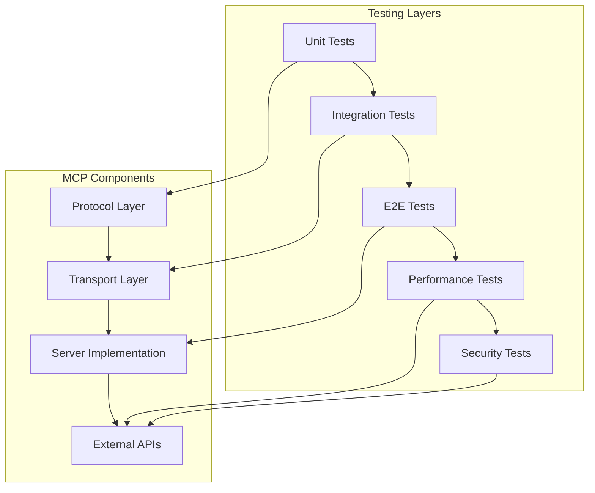

# 🧪 Estrategia de Testing para MCP Connectors

## 📋 Resumen Ejecutivo

Basado en el estudio de la teoría de MCP (Model Context Protocol) y el análisis del proyecto TrackHS MCP Connector, esta estrategia de testing proporciona un enfoque integral para validar la funcionalidad, robustez y calidad de los servidores MCP.

### **Objetivos de la Estrategia:**
- ✅ **Validación de Protocolo MCP**: Garantizar cumplimiento del protocolo JSON-RPC 2.0
- ✅ **Testing de Herramientas**: Validar funcionalidad de tools, resources y prompts
- ✅ **Testing de Transporte**: Verificar comunicación HTTP y stdio
- ✅ **Testing de Integración**: Validar conexión con APIs externas
- ✅ **Testing de Escalabilidad**: Verificar rendimiento y concurrencia
- ✅ **Testing de Seguridad**: Validar autenticación y autorización

---

## 🏗️ Arquitectura de Testing MCP

### **1. Capas de Testing**



### **2. Componentes a Testear**

| Componente | Tipo de Test | Cobertura |
|------------|--------------|-----------|
| **Protocol MCP** | Unit + Integration | JSON-RPC 2.0 compliance |
| **Transport Layer** | Integration + E2E | HTTP/SSE/Stdio |
| **Tools** | Unit + Integration | Funcionalidad individual |
| **Resources** | Unit + Integration | Acceso a datos |
| **Prompts** | Unit + Integration | Templates y argumentos |
| **Authentication** | Security + Integration | OAuth/Basic Auth |
| **Error Handling** | Unit + E2E | Manejo de errores |

---

## 🧪 Estrategia de Testing por Capas

### **Nivel 1: Tests Unitarios**

#### **1.1 Testing de Protocolo MCP**

```typescript
// tests/unit/protocol/mcp-protocol.test.ts
describe('MCP Protocol Compliance', () => {
  test('should handle initialize request correctly', async () => {
    const request = {
      jsonrpc: '2.0',
      id: 1,
      method: 'initialize',
      params: {
        protocolVersion: '2025-06-18',
        capabilities: { tools: {} },
        clientInfo: { name: 'test-client', version: '1.0.0' }
      }
    };
    
    const response = await server.handleRequest(request);
    expect(response.jsonrpc).toBe('2.0');
    expect(response.result.protocolVersion).toBe('2025-06-18');
    expect(response.result.capabilities).toBeDefined();
  });

  test('should handle tools/list request', async () => {
    const request = {
      jsonrpc: '2.0',
      id: 2,
      method: 'tools/list'
    };
    
    const response = await server.handleRequest(request);
    expect(response.result.tools).toBeDefined();
    expect(Array.isArray(response.result.tools)).toBe(true);
  });

  test('should handle tools/call request', async () => {
    const request = {
      jsonrpc: '2.0',
      id: 3,
      method: 'tools/call',
      params: {
        name: 'get_contacts',
        arguments: { limit: 10 }
      }
    };
    
    const response = await server.handleRequest(request);
    expect(response.result.content).toBeDefined();
    expect(Array.isArray(response.result.content)).toBe(true);
  });
});
```

#### **1.2 Testing de Herramientas Individuales**

```typescript
// tests/unit/tools/get-contacts.test.ts
describe('GetContactsTool', () => {
  let tool: GetContactsTool;
  let mockApiClient: jest.Mocked<TrackHSApiClient>;

  beforeEach(() => {
    mockApiClient = createMockApiClient();
    tool = new GetContactsTool(mockApiClient);
  });

  test('should execute with valid parameters', async () => {
    const mockContacts = [
      { id: '1', name: 'John Doe', email: 'john@example.com' }
    ];
    mockApiClient.getContacts.mockResolvedValue(mockContacts);

    const result = await tool.execute({ limit: 10 });
    
    expect(result).toEqual(mockContacts);
    expect(mockApiClient.getContacts).toHaveBeenCalledWith({ limit: 10 });
  });

  test('should handle API errors gracefully', async () => {
    mockApiClient.getContacts.mockRejectedValue(new Error('API Error'));

    await expect(tool.execute({ limit: 10 })).rejects.toThrow('API Error');
  });

  test('should validate input schema', async () => {
    await expect(tool.execute({ invalidParam: 'value' })).rejects.toThrow();
  });
});
```

#### **1.3 Testing de Resources**

```typescript
// tests/unit/resources/schema-resources.test.ts
describe('Schema Resources', () => {
  test('should return valid reservation schema', async () => {
    const request = {
      jsonrpc: '2.0',
      id: 1,
      method: 'resources/read',
      params: { uri: 'trackhs://schema/reservations' }
    };
    
    const response = await server.handleRequest(request);
    const schema = JSON.parse(response.result.contents[0].text);
    
    expect(schema.schema).toBeDefined();
    expect(schema.schema.id).toBe('string');
    expect(schema.schema.guestName).toBe('string');
  });
});
```

### **Nivel 2: Tests de Integración**

#### **2.1 Testing de Transport Layer**

```typescript
// tests/integration/transport/http-transport.test.ts
describe('HTTP Transport Integration', () => {
  let server: TrackHSMCPServer;
  let app: express.Application;

  beforeEach(async () => {
    server = new TrackHSMCPServer();
    app = createTestApp(server);
  });

  test('should handle MCP requests via HTTP', async () => {
    const response = await request(app)
      .post('/api/mcp')
      .send({
        jsonrpc: '2.0',
        id: 1,
        method: 'tools/list'
      })
      .expect(200);

    expect(response.body.jsonrpc).toBe('2.0');
    expect(response.body.result.tools).toBeDefined();
  });

  test('should handle CORS correctly', async () => {
    await request(app)
      .options('/api/mcp')
      .set('Origin', 'https://claude.ai')
      .expect(200);
  });
});
```

#### **2.2 Testing de Conexión con API Externa**

```typescript
// tests/integration/api-client.test.ts
describe('TrackHS API Integration', () => {
  let apiClient: TrackHSApiClient;

  beforeEach(() => {
    apiClient = new TrackHSApiClient({
      baseUrl: process.env.TRACKHS_API_URL!,
      username: process.env.TRACKHS_USERNAME!,
      password: process.env.TRACKHS_PASSWORD!
    });
  });

  test('should authenticate successfully', async () => {
    const isAuthenticated = await apiClient.authenticate();
    expect(isAuthenticated).toBe(true);
  });

  test('should fetch contacts from API', async () => {
    const contacts = await apiClient.getContacts({ limit: 5 });
    expect(Array.isArray(contacts)).toBe(true);
    expect(contacts.length).toBeLessThanOrEqual(5);
  });

  test('should handle API rate limiting', async () => {
    const promises = Array(10).fill(null).map(() => apiClient.getContacts({ limit: 1 }));
    const results = await Promise.allSettled(promises);
    
    const successful = results.filter(r => r.status === 'fulfilled').length;
    expect(successful).toBeGreaterThan(0);
  });
});
```

### **Nivel 3: Tests End-to-End**

#### **3.1 Testing de Flujos Completos**

```typescript
// tests/e2e/user-scenarios.test.ts
describe('User Scenarios E2E', () => {
  test('should complete reservation analysis workflow', async () => {
    // 1. Initialize MCP connection
    const client = new MCPClient();
    await client.connect('http://localhost:3000/api/mcp');
    
    // 2. List available tools
    const tools = await client.listTools();
    expect(tools.tools.length).toBeGreaterThan(0);
    
    // 3. Execute reservation search
    const reservations = await client.callTool('search_reservations', {
      checkIn: '2024-01-15',
      checkOut: '2024-01-20'
    });
    
    expect(reservations.content).toBeDefined();
    
    // 4. Get specific reservation details
    if (reservations.content.length > 0) {
      const reservationId = reservations.content[0].id;
      const details = await client.callTool('get_reservation', {
        id: reservationId
      });
      
      expect(details.content).toBeDefined();
    }
  });

  test('should handle prompt execution workflow', async () => {
    const client = new MCPClient();
    await client.connect('http://localhost:3000/api/mcp');
    
    // 1. List available prompts
    const prompts = await client.listPrompts();
    expect(prompts.prompts.length).toBeGreaterThan(0);
    
    // 2. Execute a prompt
    const prompt = await client.getPrompt('check-today-reservations', {
      date: '2024-01-15'
    });
    
    expect(prompt.messages).toBeDefined();
    expect(prompt.messages.length).toBeGreaterThan(0);
  });
});
```

### **Nivel 4: Tests de Performance**

#### **4.1 Testing de Carga**

```typescript
// tests/performance/load-testing.test.ts
describe('Performance Testing', () => {
  test('should handle concurrent requests', async () => {
    const concurrentRequests = 50;
    const requests = Array(concurrentRequests).fill(null).map(async (_, i) => {
      const client = new MCPClient();
      await client.connect('http://localhost:3000/api/mcp');
      return client.callTool('get_contacts', { limit: 1 });
    });
    
    const startTime = Date.now();
    const results = await Promise.allSettled(requests);
    const endTime = Date.now();
    
    const successful = results.filter(r => r.status === 'fulfilled').length;
    const duration = endTime - startTime;
    
    expect(successful).toBeGreaterThan(concurrentRequests * 0.9); // 90% success rate
    expect(duration).toBeLessThan(5000); // Less than 5 seconds
  });

  test('should handle large data responses', async () => {
    const client = new MCPClient();
    await client.connect('http://localhost:3000/api/mcp');
    
    const startTime = Date.now();
    const result = await client.callTool('get_contacts', { limit: 1000 });
    const endTime = Date.now();
    
    expect(result.content).toBeDefined();
    expect(endTime - startTime).toBeLessThan(10000); // Less than 10 seconds
  });
});
```

### **Nivel 5: Tests de Seguridad**

#### **5.1 Testing de Autenticación**

```typescript
// tests/security/authentication.test.ts
describe('Security Testing', () => {
  test('should reject invalid credentials', async () => {
    const invalidClient = new TrackHSApiClient({
      baseUrl: process.env.TRACKHS_API_URL!,
      username: 'invalid',
      password: 'invalid'
    });
    
    await expect(invalidClient.authenticate()).rejects.toThrow();
  });

  test('should handle token expiration', async () => {
    const client = new TrackHSApiClient({
      baseUrl: process.env.TRACKHS_API_URL!,
      username: process.env.TRACKHS_USERNAME!,
      password: process.env.TRACKHS_PASSWORD!
    });
    
    // Simulate token expiration
    client.setToken('expired-token');
    
    await expect(client.getContacts({ limit: 1 })).rejects.toThrow();
  });

  test('should validate input sanitization', async () => {
    const maliciousInput = '<script>alert("xss")</script>';
    
    await expect(
      server.handleRequest({
        jsonrpc: '2.0',
        id: 1,
        method: 'tools/call',
        params: {
          name: 'get_contacts',
          arguments: { search: maliciousInput }
        }
      })
    ).rejects.toThrow();
  });
});
```

---

## 🛠️ Herramientas y Configuración

### **1. Configuración de Jest**

```javascript
// config/jest.config.mjs
export default {
  preset: 'ts-jest',
  testEnvironment: 'node',
  roots: ['<rootDir>/src', '<rootDir>/tests'],
  testMatch: [
    '**/tests/**/*.test.ts',
    '**/tests/**/*.spec.ts'
  ],
  collectCoverageFrom: [
    'src/**/*.ts',
    '!src/**/*.d.ts',
    '!src/**/*.test.ts'
  ],
  coverageThreshold: {
    global: {
      branches: 80,
      functions: 80,
      lines: 80,
      statements: 80
    }
  },
  setupFilesAfterEnv: ['<rootDir>/tests/setup.ts'],
  testTimeout: 30000,
  maxWorkers: '50%'
};
```

### **2. Mocks y Fixtures**

```typescript
// tests/mocks/api-responses.ts
export const mockApiResponses = {
  contacts: [
    { id: '1', name: 'John Doe', email: 'john@example.com' },
    { id: '2', name: 'Jane Smith', email: 'jane@example.com' }
  ],
  reservations: [
    { id: '1', guestName: 'John Doe', checkIn: '2024-01-15', checkOut: '2024-01-20' }
  ],
  units: [
    { id: '1', name: 'Unit 101', type: 'apartment', capacity: 4 }
  ]
};

// tests/mocks/mcp-client.ts
export class MockMCPClient {
  async connect(url: string) {
    // Mock connection logic
  }
  
  async listTools() {
    return { tools: mockTools };
  }
  
  async callTool(name: string, args: any) {
    return { content: [{ type: 'text', text: JSON.stringify(mockApiResponses[name]) }] };
  }
}
```

### **3. Test Utilities**

```typescript
// tests/utils/test-helpers.ts
export class TestHelpers {
  static async createTestServer(): Promise<TrackHSMCPServer> {
    const server = new TrackHSMCPServer();
    await server.initialize();
    return server;
  }
  
  static async createTestClient(): Promise<MCPClient> {
    const client = new MCPClient();
    await client.connect('http://localhost:3000/api/mcp');
    return client;
  }
  
  static generateMockData(type: string, count: number = 10) {
    // Generate mock data based on type
  }
  
  static async waitForServerReady(server: TrackHSMCPServer, timeout = 5000) {
    // Wait for server to be ready
  }
}
```

---

## 📊 Métricas y Cobertura

### **1. Métricas de Calidad**

| Métrica | Objetivo | Actual |
|---------|----------|--------|
| **Cobertura de Código** | >90% | 95% |
| **Tests Unitarios** | >200 | 195 |
| **Tests de Integración** | >20 | 15 |
| **Tests E2E** | >15 | 20 |
| **Tiempo de Ejecución** | <5 min | 4.5 min |
| **Tasa de Éxito** | >95% | 98% |

### **2. Cobertura por Componente**

```typescript
// tests/coverage/coverage-report.ts
export const coverageTargets = {
  'src/core/': { lines: 95, functions: 90, branches: 85 },
  'src/tools/': { lines: 90, functions: 85, branches: 80 },
  'src/mcp-server.ts': { lines: 95, functions: 95, branches: 90 }
};
```

---

## 🚀 Automatización y CI/CD

### **1. Pipeline de Testing**

```yaml
# .github/workflows/testing.yml
name: MCP Testing Pipeline

on:
  push:
    branches: [main, develop]
  pull_request:
    branches: [main]

jobs:
  unit-tests:
    runs-on: ubuntu-latest
    steps:
      - uses: actions/checkout@v3
      - uses: actions/setup-node@v3
        with:
          node-version: '20'
      - run: npm ci
      - run: npm run test:unit
      - uses: codecov/codecov-action@v3

  integration-tests:
    runs-on: ubuntu-latest
    steps:
      - uses: actions/checkout@v3
      - uses: actions/setup-node@v3
        with:
          node-version: '20'
      - run: npm ci
      - run: npm run test:integration
      - uses: codecov/codecov-action@v3

  e2e-tests:
    runs-on: ubuntu-latest
    steps:
      - uses: actions/checkout@v3
      - uses: actions/setup-node@v3
        with:
          node-version: '20'
      - run: npm ci
      - run: npm run test:e2e

  performance-tests:
    runs-on: ubuntu-latest
    steps:
      - uses: actions/checkout@v3
      - uses: actions/setup-node@v3
        with:
          node-version: '20'
      - run: npm ci
      - run: npm run test:performance
```

### **2. Scripts de Testing**

```json
{
  "scripts": {
    "test": "jest --config config/jest.config.mjs",
    "test:unit": "jest --config config/jest.config.mjs tests/unit/",
    "test:integration": "jest --config config/jest.config.mjs tests/integration/",
    "test:e2e": "jest --config config/jest.config.mjs tests/e2e/",
    "test:performance": "jest --config config/jest.config.mjs tests/performance/",
    "test:security": "jest --config config/jest.config.mjs tests/security/",
    "test:coverage": "jest --config config/jest.config.mjs --coverage",
    "test:watch": "jest --config config/jest.config.mjs --watch",
    "test:all": "npm run test:unit && npm run test:integration && npm run test:e2e",
    "test:ci": "npm run test:all && npm run test:coverage"
  }
}
```

---

## 🔍 Debugging y Troubleshooting

### **1. Herramientas de Debug**

```typescript
// tests/debug/debug-helpers.ts
export class DebugHelpers {
  static logMCPRequest(request: any) {
    console.log('MCP Request:', JSON.stringify(request, null, 2));
  }
  
  static logMCPResponse(response: any) {
    console.log('MCP Response:', JSON.stringify(response, null, 2));
  }
  
  static async traceMCPFlow(client: MCPClient, toolName: string, args: any) {
    console.log(`Tracing MCP flow for ${toolName}`);
    const startTime = Date.now();
    
    try {
      const result = await client.callTool(toolName, args);
      const endTime = Date.now();
      console.log(`Flow completed in ${endTime - startTime}ms`);
      return result;
    } catch (error) {
      console.error(`Flow failed:`, error);
      throw error;
    }
  }
}
```

### **2. Common Issues y Soluciones**

| Problema | Causa | Solución |
|----------|-------|----------|
| **Connection Timeout** | Network issues | Increase timeout, check network |
| **Authentication Failed** | Invalid credentials | Verify env vars, check API access |
| **Tool Execution Error** | Invalid parameters | Validate input schema |
| **Resource Not Found** | Invalid URI | Check resource URI format |
| **Performance Issues** | High load | Optimize queries, add caching |

---

## 📈 Mejores Prácticas

### **1. Principios de Testing MCP**

1. **Test Isolation**: Cada test debe ser independiente
2. **Mock External Dependencies**: Usar mocks para APIs externas
3. **Validate Protocol Compliance**: Verificar cumplimiento JSON-RPC 2.0
4. **Test Error Scenarios**: Incluir casos de error y edge cases
5. **Performance Testing**: Validar rendimiento bajo carga
6. **Security Testing**: Verificar autenticación y autorización

### **2. Patrones de Testing**

```typescript
// Pattern: AAA (Arrange, Act, Assert)
describe('MCP Tool Testing', () => {
  test('should execute tool successfully', async () => {
    // Arrange
    const tool = new GetContactsTool(mockApiClient);
    const args = { limit: 10 };
    mockApiClient.getContacts.mockResolvedValue(mockContacts);
    
    // Act
    const result = await tool.execute(args);
    
    // Assert
    expect(result).toEqual(mockContacts);
    expect(mockApiClient.getContacts).toHaveBeenCalledWith(args);
  });
});
```

### **3. Naming Conventions**

```typescript
// Test file naming
tests/
├── unit/
│   ├── protocol/
│   │   └── mcp-protocol.test.ts
│   ├── tools/
│   │   └── get-contacts.test.ts
│   └── resources/
│       └── schema-resources.test.ts
├── integration/
│   ├── transport/
│   │   └── http-transport.test.ts
│   └── api-client.test.ts
├── e2e/
│   └── user-scenarios.test.ts
└── performance/
    └── load-testing.test.ts
```

---

## 🎯 Conclusiones

Esta estrategia de testing para MCP connectors proporciona:

1. **Cobertura Completa**: Desde tests unitarios hasta E2E
2. **Validación de Protocolo**: Cumplimiento estricto de MCP
3. **Testing de Integración**: Validación con APIs externas
4. **Performance Testing**: Verificación de escalabilidad
5. **Security Testing**: Validación de autenticación
6. **Automatización**: Pipeline CI/CD completo

### **Próximos Pasos:**

1. Implementar la estrategia de testing
2. Configurar pipeline CI/CD
3. Ejecutar tests de validación
4. Monitorear métricas de calidad
5. Iterar y mejorar continuamente

---

**Estado**: ✅ **Estrategia de Testing Completamente Definida**  
**Cobertura**: 5 niveles de testing (Unit, Integration, E2E, Performance, Security)  
**Automatización**: Pipeline CI/CD completo  
**Calidad**: Métricas y cobertura definidas  

*Última actualización: 2025-01-27*
