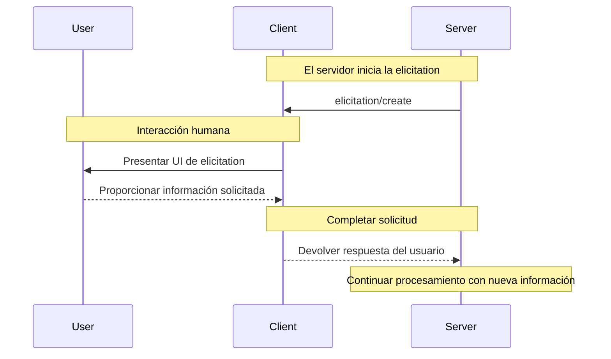

# Clientes vs Servidores MCP

Los clientes y servidores MCP son componentes fundamentales del protocolo, cada uno con roles específicos en la arquitectura.

## Clientes MCP

Los clientes MCP son instanciados por aplicaciones host para comunicarse con servidores MCP específicos. La aplicación host, como Claude.ai o un IDE, gestiona la experiencia general del usuario y coordina múltiples clientes. Cada cliente maneja una comunicación directa con un servidor.

Es importante entender la distinción: el *host* es la aplicación con la que interactúan los usuarios, mientras que los *clientes* son los componentes a nivel de protocolo que permiten las conexiones con servidores.

### Características Principales de los Clientes

Además de hacer uso del contexto proporcionado por los servidores, los clientes pueden proporcionar varias características a los servidores. Estas características del cliente permiten a los autores de servidores construir interacciones más ricas.

| Característica | Explicación | Ejemplo |
| --------------- | ----------- | ------- |
| **Sampling** | Permite a los servidores solicitar completaciones de LLM a través del cliente, habilitando un flujo de trabajo agéntico. Este enfoque pone al cliente en control completo de los permisos del usuario y las medidas de seguridad. | Un servidor para reservar viajes puede enviar una lista de vuelos a un LLM y solicitar que el LLM elija el mejor vuelo para el usuario. |
| **Roots** | Permite a los clientes especificar qué directorios deben enfocarse los servidores, comunicando el alcance previsto a través de un mecanismo de coordinación. | Un servidor para reservar viajes puede tener acceso a un directorio específico, desde el cual puede leer el calendario del usuario. |
| **Elicitation** | Permite a los servidores solicitar información específica de los usuarios durante las interacciones, proporcionando una forma estructurada para que los servidores recopilen información bajo demanda. | Un servidor que reserva viajes puede preguntar por las preferencias del usuario sobre asientos de avión, tipo de habitación o su número de contacto para finalizar una reserva. |

### Elicitation

La elicitation permite a los servidores solicitar información específica de los usuarios durante las interacciones, creando flujos de trabajo más dinámicos y responsivos.

#### Flujo de Elicitation

### Roots

Los roots definen límites del sistema de archivos para las operaciones del servidor, permitiendo a los clientes especificar en qué directorios deben enfocarse los servidores.

Los roots son un mecanismo para que los clientes comuniquen límites de acceso al sistema de archivos a los servidores. Consisten en URIs de archivos que indican directorios donde los servidores pueden operar, ayudando a los servidores a entender el alcance de archivos y carpetas disponibles.

### Sampling

El sampling permite a los servidores solicitar completaciones de modelos de lenguaje a través del cliente, habilitando comportamientos agénticos mientras mantiene la seguridad y el control del usuario.

## Servidores MCP

Los servidores MCP son programas que exponen capacidades específicas a las aplicaciones de IA a través de interfaces de protocolo estandarizadas.

Ejemplos comunes incluyen servidores del sistema de archivos para acceso a documentos, servidores de base de datos para consultas de datos, servidores de GitHub para gestión de código, servidores de Slack para comunicación de equipo, y servidores de calendario para programación.

### Características Principales de los Servidores

Los servidores proporcionan funcionalidad a través de tres bloques de construcción:

| Característica | Explicación | Ejemplos | Quién lo controla |
| ------------- | ----------- | -------- | ----------------- |
| **Tools** | Funciones que tu LLM puede llamar activamente, y decide cuándo usarlas basándose en las solicitudes del usuario. Las herramientas pueden escribir en bases de datos, llamar APIs externas, modificar archivos, o activar otra lógica. | Buscar vuelos Enviar mensajes Crear eventos de calendario | Modelo |
| **Resources** | Fuentes de datos pasivas que proporcionan acceso de solo lectura a información para contexto, como contenidos de archivos, esquemas de base de datos, o documentación de API. | Recuperar documentos Acceder a bases de conocimiento Leer calendarios | Aplicación |
| **Prompts** | Plantillas de instrucciones pre-construidas que le dicen al modelo cómo trabajar con herramientas y recursos específicos. | Planificar unas vacaciones Resumir mis reuniones Redactar un email | Usuario |

### Tools (Herramientas)

Las herramientas permiten a los modelos de IA realizar acciones. Cada herramienta define una operación específica con entradas y salidas tipadas. El modelo solicita la ejecución de herramientas basándose en el contexto.

#### Cómo Funcionan las Herramientas

Las herramientas son interfaces definidas por esquemas que los LLMs pueden invocar. MCP usa JSON Schema para validación. Cada herramienta realiza una sola operación con entradas y salidas claramente definidas.

**Operaciones del protocolo:**

| Método | Propósito | Devuelve |
| ------ | --------- | -------- |
| `tools/list` | Descubrir herramientas disponibles | Array de definiciones de herramientas con esquemas |
| `tools/call` | Ejecutar una herramienta específica | Resultado de ejecución de la herramienta |

### Resources (Recursos)

Los recursos proporcionan acceso estructurado a información que la aplicación de IA puede recuperar y proporcionar a los modelos como contexto.

#### Cómo Funcionan los Recursos

Los recursos exponen datos de archivos, APIs, bases de datos, o cualquier otra fuente que una IA necesita para entender el contexto. Las aplicaciones pueden acceder a esta información directamente y decidir cómo usarla.

Cada recurso tiene un URI único (como `file:///path/to/document.md`) y declara su tipo MIME para el manejo apropiado del contenido.

**Operaciones del protocolo:**

| Método | Propósito | Devuelve |
| ------ | --------- | -------- |
| `resources/list` | Listar recursos directos disponibles | Array de descriptores de recursos |
| `resources/templates/list` | Descubrir plantillas de recursos | Array de definiciones de plantillas de recursos |
| `resources/read` | Recuperar contenidos de recursos | Datos de recursos con metadatos |
| `resources/subscribe` | Monitorear cambios de recursos | Confirmación de suscripción |

### Prompts (Prompts)

Los prompts proporcionan plantillas reutilizables. Permiten a los autores de servidores MCP proporcionar prompts parametrizados para un dominio, o mostrar cómo usar mejor el servidor MCP.

#### Cómo Funcionan los Prompts

Los prompts son plantillas estructuradas que definen entradas esperadas y patrones de interacción. Son controlados por el usuario, requiriendo invocación explícita en lugar de activación automática.

**Operaciones del protocolo:**

| Método | Propósito | Devuelve |
| ------ | --------- | -------- |
| `prompts/list` | Descubrir prompts disponibles | Array de descriptores de prompts |
| `prompts/get` | Recuperar detalles del prompt | Definición completa del prompt con argumentos |

## Trabajando Juntos

El verdadero poder de MCP emerge cuando múltiples servidores trabajan juntos, combinando sus capacidades especializadas a través de una interfaz unificada.

### Ejemplo: Planificación de Viajes Multi-Servidor

Considera una aplicación de planificador de viajes personalizada con IA, con tres servidores conectados:

* **Servidor de Viajes** - Maneja vuelos, hoteles e itinerarios
* **Servidor del Clima** - Proporciona datos climáticos y pronósticos
* **Servidor de Calendario/Email** - Gestiona horarios y comunicaciones

#### El Flujo Completo

1. **El usuario invoca un prompt con parámetros**
2. **El usuario selecciona recursos para incluir**
3. **La IA procesa la solicitud usando herramientas**

**El resultado:** A través de múltiples servidores MCP, el usuario investigó y reservó un viaje a Barcelona adaptado a su horario. El prompt "Planificar Vacaciones" guió a la IA para combinar Recursos (disponibilidad del calendario e historial de viajes) con Herramientas (buscando vuelos, reservando hoteles, actualizando calendarios) a través de diferentes servidores.
