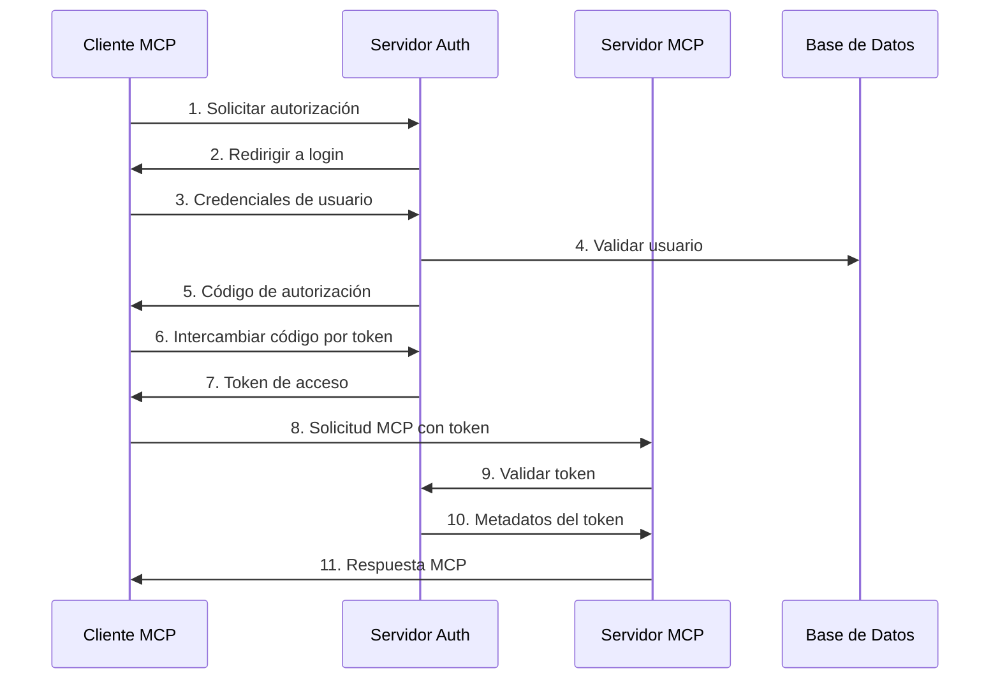

# Conceptos Básicos de Servidores MCP Remotos

## ¿Qué son los Servidores MCP Remotos?

Los servidores MCP remotos funcionan de manera similar a los servidores MCP locales, pero están alojados en internet en lugar de en tu máquina local. Exponen herramientas, prompts y recursos que los clientes MCP pueden usar para realizar tareas en tu nombre.

### Diferencias Clave vs Servidores Locales

| Aspecto | Servidores Locales | Servidores Remotos |
|---------|-------------------|-------------------|
| **Ubicación** | Ejecutan en tu máquina | Alojados en internet |
| **Instalación** | Requieren instalación local | Accesibles vía URL |
| **Mantenimiento** | Actualizaciones manuales | Actualizaciones centralizadas |
| **Seguridad** | Acceso directo al sistema | Autenticación requerida |
| **Escalabilidad** | Limitada por recursos locales | Escalable horizontalmente |

## Arquitectura de Servidores Remotos

### Componentes Principales

1. **Servidor de Autorización (Opcional)**
   - Maneja autenticación OAuth 2.0
   - Emite y valida tokens
   - Puede ser separado o integrado

2. **Servidor de Recursos MCP**
   - Implementa el protocolo MCP
   - Expone herramientas, recursos y prompts
   - Valida tokens de acceso

3. **Base de Datos/Sesiones**
   - Almacena estado de sesiones
   - Gestiona tokens y usuarios
   - Redis recomendado para producción

### Flujo de Comunicación



## Tipos de Servidores Remotos

### 1. Servidores Públicos
- **Acceso**: Sin autenticación o con API keys
- **Uso**: Servicios públicos, APIs abiertas
- **Ejemplo**: Servidor de clima, APIs de datos públicos

### 2. Servidores Autenticados
- **Acceso**: Requiere OAuth 2.0
- **Uso**: Servicios privados, datos de usuario
- **Ejemplo**: Servidor de GitHub, Google Drive

### 3. Servidores Empresariales
- **Acceso**: SSO corporativo
- **Uso**: Sistemas internos, datos sensibles
- **Ejemplo**: Servidor de CRM, base de datos corporativa

## Transportes Soportados

### HTTP Streamable (Recomendado)
- **Ventajas**: Escalable, estándar web
- **Uso**: Producción, múltiples clientes
- **Implementación**: REST API con SSE

### SSE (Server-Sent Events)
- **Ventajas**: Tiempo real, simple
- **Uso**: Desarrollo, prototipos
- **Implementación**: EventSource API

## Consideraciones de Seguridad

### Autenticación
- **OAuth 2.0 + PKCE**: Estándar recomendado
- **JWT**: Para tokens autofirmados
- **API Keys**: Para servicios simples

### Autorización
- **Scopes**: Control granular de permisos
- **Audience**: Validación de destinatario
- **Expiration**: Tokens con tiempo de vida

### Comunicación Segura
- **HTTPS**: Obligatorio en producción
- **CORS**: Configuración apropiada
- **Rate Limiting**: Protección contra abuso

## Patrones de Implementación

### Patrón 1: Servidor Separado (Recomendado)
```
Cliente → Servidor Auth → Servidor MCP
```
- **Ventajas**: Separación de responsabilidades, escalabilidad
- **Uso**: Producción, múltiples servicios

### Patrón 2: Servidor Integrado
```
Cliente → Servidor MCP (con auth integrada)
```
- **Ventajas**: Simplicidad, menos componentes
- **Uso**: Prototipos, servicios simples

## Próximos Pasos

1. **Implementa autenticación**: Sigue la guía de [OAuth y Autenticación](./oauth-autenticacion.md)
2. **Configura el transporte**: Aprende sobre [Transporte HTTP](./transporte-http.md)
3. **Aplica mejores prácticas**: Revisa [Mejores Prácticas](./mejores-practicas.md)
4. **Despliega en producción**: Usa [Despliegue en Producción](./despliegue-produccion.md)
